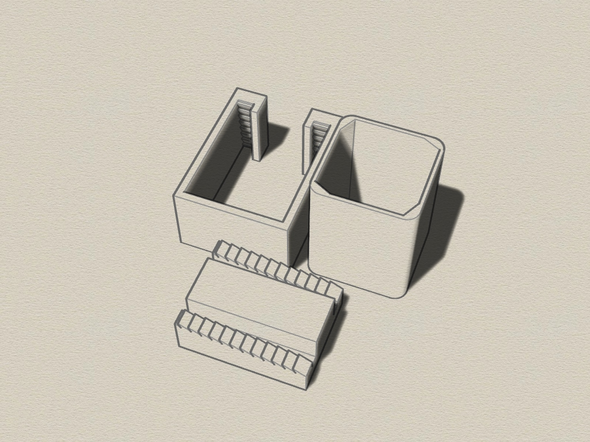
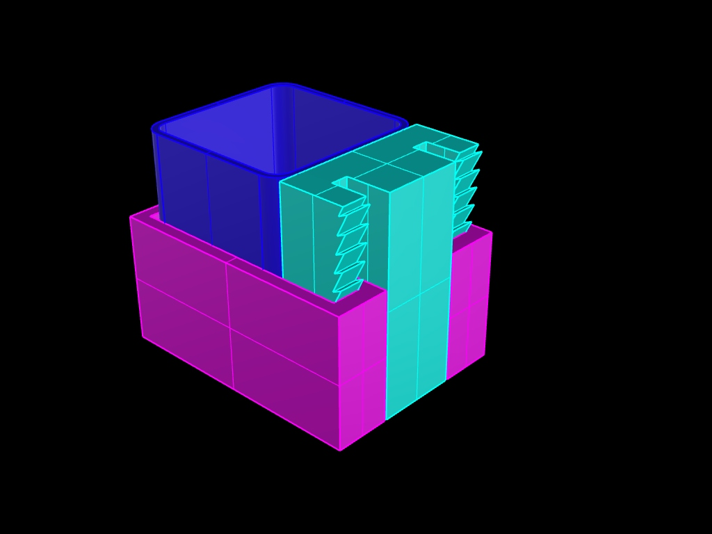
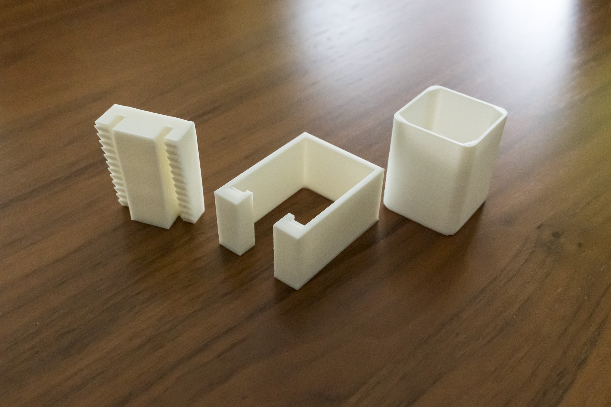
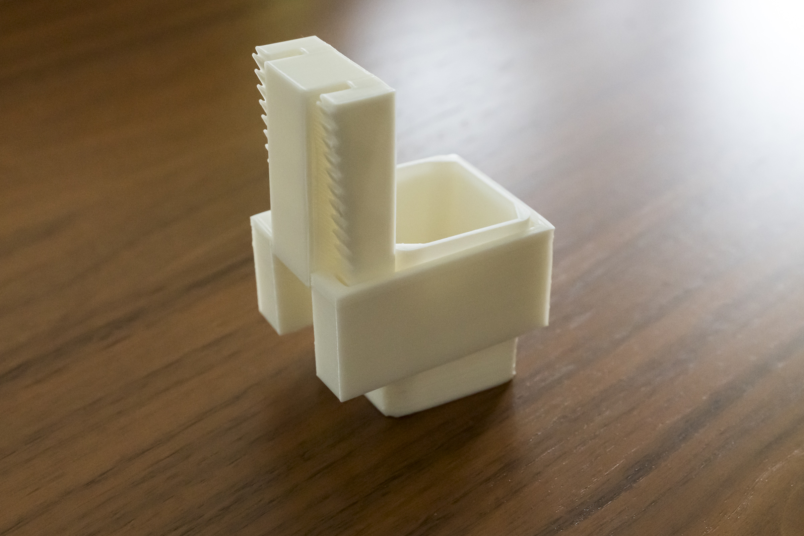

# Square-tube clamp / 4-Kantrohr-Schelle
3D printable square-tube clamp as a concept. Created with Rhino 6.

## 3D Clamp

The clamp consists of two parts which are pushed into each other.
Teeth facing each other prevent the clamp from slipping out.
The clamp is to be regarded as a concept. On the surface one can design hooks or similar to fasten something to a square tube.

Requirements:
* 3D printer 
* Filament of your choice

## View
 
 
 
 
